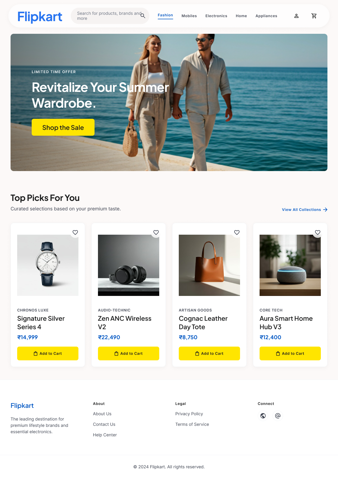

# 🛒 Flipkart UI Redesign — Elevating the E-Commerce Experience

## 🚀 Overview
**Flipkart UI Redesign** is a UX/UI case study focused on modernizing one of the largest e-commerce platforms. Instead of overwhelming users with cramped banners, endless competing tags, and cluttered navigation, this redesign simplifies the shopping journey into a clean, premium visual experience.

The project is built around one core idea: *Clutter kills conversions.* 
This redesign reduces cognitive friction by guiding users from browsing to buying utilizing clear visual hierarchy, premium lifestyle imagery, and ample whitespace.

---

# 🎯 Problem Statement
Modern e-commerce shoppers often struggle with:
- Feeling overwhelmed by too many promotional banners and tight product grids.
- High cognitive load when evaluating chaotic product cards (competing discount tags, weights, ratings, and tiny buttons).
- Difficult navigation due to tiny, clustered touch targets on both mobile and desktop screens.

Most mega-retailers focus on **packing** as much information as possible onto the screen, but very few help users actually **focus on the product**. This redesign bridges that gap.

---

# 🧠 Core Concept: "Clear & Clickable"
The entire user interface is optimized around reducing visual noise and making primary actions effortless. The improved layout focuses on:

1. **Discover:** The `Homepage` uses ample whitespace and clean typography to present categories without overwhelming the user.
2. **Navigate:** A floating, minimalist header keeps search, login, and cart access frictionless.
3. **Evaluate:** `Product Cards` are stripped of unnecessary visual noise, focusing entirely on high-quality images, clean brand typography, and bold prices.
4. **Act:** Every product card features a distinct, highly visible Bright Yellow button for instant, unmistakable cart additions.

---

# 📐 High-Fidelity Design Process
This phase focuses strictly on **high-fidelity responsive mockups** to validate:
- Visual hierarchy and aesthetic modernization.
- Effective use of whitespace to reduce cognitive load.
- Cross-device responsiveness (Desktop 1440px to Mobile 390px).
- Improved accessibility for primary Call-to-Action buttons.

By completely overhauling the visual identity with a modern, clean aesthetic, the design prioritizes a premium and calming user experience before, during, and after checkout.

---

# 🗺️ Core Screens (Phase 1 Blueprint)

### 1. Modern Desktop Homepage
A clean UI featuring a sleek header, breathable product grids, and text-based navigation. The hero section features premium, lifestyle-focused imagery ("Revitalize Your Summer Wardrobe") to create a high-end shopping feel, followed by a curated "Top Picks" grid with highly visible yellow "Add to Cart" buttons.

### 2. Grocery Landing Page
An organized, dynamic promotional layout. The vibrant "Payday Sale" banner grabs attention without clutter, followed by clean filter pills. The "Bestsellers" grid highlights everyday items with a minimalist card design, neatly structured pricing, and subtle discount tags. 

### 3. Responsive Mobile Grocery Section
Adapted for seamless mobile shopping. Features a clean top header with a hamburger menu, horizontal scrolling category pills, and an accessible bottom navigation bar. The 2-column product grid utilizes large, square product images and massive yellow "+" buttons tucked into the bottom right corners for effortless thumb targeting.

---

# 📌 Next Steps & Future Iterations
🚧 **Current Phase:** High-Fidelity UI Design & Responsive Layouts

**Upcoming Milestones:**
- **Interactive Prototyping:** Link the high-fidelity screens in Figma to create a clickable prototype.
- **Usability Testing:** Test the new, cleaner layout with real users to measure the speed of finding and adding a product to the cart on both desktop and mobile.
- **Design System Documentation:** Finalize the component library (buttons, cards, typography) for seamless developer handoff.

---

**Designed by:** Om Chandrakar
